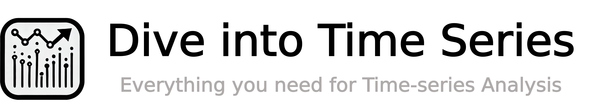

<!-- <h1 align="center">Awesome Time Series</h1> -->

![[MIT License]](https://img.shields.io/badge/license-MIT-green.svg)
 

📖 A curated list of awesome time-series papers, benchmarks, datasets, tutorials.

If you find any missed resources or errors, please feel free to open an issue or make a PR.

## Main Recent Update

- [Sep. 22, 2024] Create the repo!

## Table of Contents
- [Introduction and Tutorials](#tutorial)
- [Time-series Analysis Tasks and Related Papers](#paper)
    * [Forecasting](#forecasting)
    * [Anomaly Detection](#tsad)
    * [Classification](#classification)
    * [Clustering](#clustering)
    * [Segmentation](#segmentation)
    * [Imputation](#imputation)

<h2 id="tutorial">Introduction and Tutorials</h2>

### General Time Series Survey
* TODO

### Tutorial
* Time-Series Anomaly Detection: Overview and New Trends, in *VLDB* 2024. [\[Link\]](https://www.vldb.org/pvldb/vol17/p4229-liu.pdf) [\[Video\]](https://youtu.be/96869qimXAA?si=kww8SDL0HZ9CS4Y7)
* Out-of-Distribution Generalization in Time Series, in *AAAI* 2024. [\[Link\]](https://ood-timeseries.github.io/) [\[Slides\]](https://github.com/ood-timeseries/ood-timeseries.github.io/files/14325164/AAAI24_tutorial_OOD_in_time_series__slides_02182024.pdf)
* Robust Time Series Analysis and Applications: An Interdisciplinary Approach, in *ICDM* 2023. [\[Link\]](https://sites.google.com/view/timeseries-tutorial-icdm2023)

### Blogs
* TODO

<h2 id="paper">Time-series Analysis Tasks and Related Papers</h2>

<h3 id="forecasting">Forecasting</h3>
* TODO

<h3 id="tsad">Anomaly Detection</h3>
* TODO

<h3 id="classification">Classification</h3>
* TODO

<h3 id="clustering">Clustering</h3>
* TODO

<h3 id="segmentation">Segmentation</h3>
* TODO

<h3 id="imputation">Imputation</h3>
* TODO

